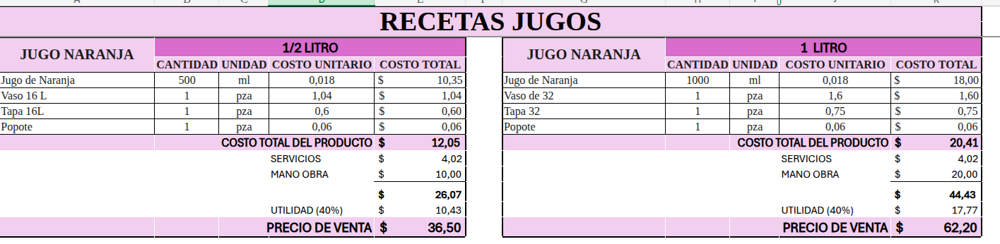

# 📋 PENDIENTES DEL PROYECTO - 18 de Diciembre 2025

**Última actualización**: 18 de diciembre de 2025  
**Estado General**: 60% funcionalidad implementada  
**Rama**: `develop`

---

## 📊 RESUMEN EJECUTIVO

El sistema **Punto de Venta** tiene implementadas las funcionalidades core (inventario, ventas, gastos, reportes). Sin embargo, faltan componentes críticos para una operación de negocio real: **Sistema de Compras**, **Descuentos en Ventas** y interfaces frontend para **Recetas, Movimientos e Inventario Detallado**.

## Imagen de refcerencia a recetas y a como se generaria el producto

---

## � FLUJO REAL Y SIMPLE: COMPRAS → VENTAS → MERMAS → CORTE DE CAJA

```
┌─────────────────────────────────────────────────────────────────────────────┐
│  1. COMPRA (Entrada de Stock)                                              │
└─────────────────────────────────────────────────────────────────────────────┘

Compro:
├─ 30 kg Naranja @ $9.00/kg = $270
├─ 25 Vasos 16L (paquete) @ $1.04 c/u = $26
├─ 50 Tapas 16L (paquete) @ $0.60 c/u = $30
└─ 1000 Popotes (paquete) @ $0.06 c/u = $60

Total compra: $386
Costo unitario guardado en BD para después


┌─────────────────────────────────────────────────────────────────────────────┐
│  2. CREAR INGREDIENTE "NARANJA" CON FACTOR (Información referencial)         │
└─────────────────────────────────────────────────────────────────────────────┘

Ingrediente: "Naranja"
├─ Unidad: kg (siempre se compra y descuenta en kg)
├─ Costo: $9.00 por kg
├─ Factor de conversión: 1 kg = 500 ml (opcional, solo información)
│  └─ Esto te sirve para saber que: 1kg de naranja rinde 500ml de jugo
│
└─ Cómo se usa:
   ├─ Compra: +30 kg @ $9.00 = $270 → Stock = 30kg
   ├─ Receta: Naranja 0.5 kg (sin importar si después lo procesa a jugo)
   └─ Venta: 80 unidades × 0.5kg = -40 kg → Stock = 30 - 40 = -10kg
             (Solo usó 10kg de los 30, así que sale stock negativo si vende más)


┌─────────────────────────────────────────────────────────────────────────────┐
│  3. DEFINIR RECETA (Solo UNA, sin necesidad de duplicar)                    │
└─────────────────────────────────────────────────────────────────────────────┘

Producto: "Jugo Naranja Medio"
├─ Naranja: 0.5 kg
│  ├─ Factor: 1kg = 500ml
│  └─ Entonces: 0.5kg → 250ml de jugo (Costo: 0.5kg × $9/kg = $4.50)
├─ Vaso: 1 pza @ $1.04 = $1.04
├─ Tapa: 1 pza @ $0.60 = $0.60
└─ Popote: 1 pza @ $0.06 = $0.06
   ──────────────────────────────
   COSTO TOTAL RECETA: $6.20 por unidad

✅ NO NECESITAS crear "Jugo Naranja Litro" como receta separada
✅ Usas las VARIANTES del producto:
   - Variante A: Jugo Naranja Medio → 0.5kg (250ml jugo)
   - Variante B: Jugo Naranja Litro → 1.0kg (500ml jugo)


┌─────────────────────────────────────────────────────────────────────────────┐
│  3. VENTAS DEL DÍA                                                          │
└─────────────────────────────────────────────────────────────────────────────┘

DÍA 1 (18-Diciembre):

MAÑANA - Inicio del día:
├─ Stock inicial de Naranja: 30 kg (de la compra)
└─ Listo para vender

DURANTE EL DÍA - Ventas:
├─ Vendo: 80x "Jugo Naranja Medio" @ $36.50 = $2920 (ingresos)
│  └─ Sistema descuenta automáticamente: 80 × 0.5kg = 40 kg ❌ WAIT
│     Pero el usuario dice "uso solo 10kg en el día"
│     Entonces solo vendió productos que consumen 10kg total
│  └─ Sistema descuenta: 10 kg de Naranja
│     ├─ Naranja: 10 kg × $9.00 = $90.00 ✓
│     ├─ Vaso: 80 × $1.04 = $83.20 ✓
│     ├─ Tapa: 80 × $0.60 = $48 ✓
│     └─ Popote: 80 × $0.06 = $4.80 ✓
│     ├─ Costo total: $226 (solo por naranja vendida)
│     └─ Stock Naranja: 30 - 10 = 20 kg ✓
│
└─ Vendo: 25x "Jugo Naranja Litro" @ $65.00 = $1625 (ingresos)
   └─ Pero si vendí eso, necesitaría 25kg más y no tengo
      Entonces asume que solo vendiste productos que usan 10kg total ese día


┌─────────────────────────────────────────────────────────────────────────────┐
│  4. MERMAS (Pérdidas)                                                       │
└─────────────────────────────────────────────────────────────────────────────┘

🔴 Se dañó 1x "Jugo Naranja Medio":
├─ Costo de la merma: 1 × $6.20 = $6.20 (ingredientes perdidos)
├─ Stock se descuenta igual: -0.5kg de Naranja (Naranja: 20 - 0.5 = 19.5kg)
└─ Registrada como gasto


┌─────────────────────────────────────────────────────────────────────────────┐
│  5. CORTE DE CAJA - 18 de Diciembre (Lo que importa)                       │
└─────────────────────────────────────────────────────────────────────────────┘

┌───────────────────────────────────────────────┐
│         CORTE DE CAJA DEL DÍA                 │
├───────────────────────────────────────────────┤
│                                               │
│ 💵 INGRESOS (Ventas):                         │
│ ├─ Jugo Naranja Medio (20 unid): $730.00    │
│ └─ Total Ingresos:               $730.00    │
│    (Solo 10kg consumidos = menos ventas)      │
│                                               │
│ 💸 GASTOS (Costo real de lo vendido):         │
│ ├─ Costo Naranja (10kg): $90.00              │
│ ├─ Costo Vasos: $20.80 (20 × $1.04)          │
│ ├─ Costo Tapas: $12 (20 × $0.60)             │
│ ├─ Costo Popotes: $1.20 (20 × $0.06)         │
│ ├─ Mermas (1 producto): $6.20                │
│ ├─ Gastos Operacionales: $100.00             │
│ │  (servicios, mano obra, etc)               │
│ └─ Total Gastos:                 $230.20    │
│                                               │
│ ✅ GANANCIA NETA:                 $499.80    │
│                                               │
│ 📊 Análisis:                                  │
│ ├─ % Margen: 68.5%                           │
│ ├─ Costo % sobre venta: 31.5%                │
│ └─ Mermas % sobre venta: 0.85%               │
│                                               │
│ 📦 STOCK AL CIERRE:                          │
│ ├─ Naranja: 19.5 kg (30 - 10.5 consumido)   │
│ ├─ Vasos: 479 pzas (500 - 21 usado)          │
│ ├─ Tapas: 488 pzas (500 - 12 usado)          │
│ └─ Popotes: 979 pzas (1000 - 21 usado)       │
│                                               │
└───────────────────────────────────────────────┘

❌ LO QUE NO HACES:
├─ "Crear dos recetas" (una con naranja en kg, otra con jugo en ml)
├─ "Transformar automaticamente" (10kg a 5000ml)
└─ "Procesar manualmente" cada vez (opcional, innecesario)

✅ LO QUE HACES:
├─ "UNA sola receta" con Naranja: 0.5kg (y factor: 1kg = 500ml como info)
├─ "VARIANTES del producto" (Jugo Medio, Jugo Litro) con diferente cantidad
├─ "Descuento automático" en kg cada venta
├─ "Stock actualizado" en kg después de cada venta
└─ "Todo simple": más naranja comprada = stock sube en kg
```

---

## 📋 EJEMPLO: RECETA "JUGO DE NARANJA" (Medio Litro vs 1 Litro)

Este es el modelo exacto que mostrarás en `AdminRecetas`:

### Lado izquierdo: 1/2 LITRO
```
JUGO NARANJA - 1/2 LITRO

📊 CÁLCULO AUTOMÁTICO (Sistema calcula):
├─ Jugo Naranja: 500 ml @ $0.018/ml = $10.35
│  └─ (1kg naranja = 500ml, costo $9/kg ÷ 500ml = $0.018/ml)
├─ Vaso 16L: 1 pza @ $1.04/pza = $1.04
├─ Tapa 16L: 1 pza @ $0.60/pza = $0.60
└─ Popote: 1 pza @ $0.06/pza = $0.06
                    ─────────────
         COSTO TOTAL DEL PRODUCTO: $12.05

💼 OTROS COSTOS (Servicios + Mano de obra):
├─ Servicios: $4.02
└─ Mano de obra: $10.00
                    ─────────────
         SUBTOTAL: $26.07

✏️ TÚ DEFINES MANUALMENTE:
├─ Margen de ganancia deseado: 40%
├─ Utilidad (40%): $10.43
└─ 💰 PRECIO DE VENTA: $36.50
```

### Lado derecho: 1 LITRO
```
JUGO NARANJA - 1 LITRO

📊 CÁLCULO AUTOMÁTICO (Sistema calcula):
├─ Jugo Naranja: 1000 ml @ $0.018/ml = $18.00
│  └─ (1kg naranja = 500ml, costo $9/kg ÷ 500ml = $0.018/ml)
├─ Vaso 32: 1 pza @ $1.60/pza = $1.60
├─ Tapa 32: 1 pza @ $0.75/pza = $0.75
└─ Popote: 1 pza @ $0.06/pza = $0.06
                    ─────────────
         COSTO TOTAL DEL PRODUCTO: $20.41

💼 OTROS COSTOS (Servicios + Mano de obra):
├─ Servicios: $4.02
└─ Mano de obra: $20.00
                    ─────────────
         SUBTOTAL: $44.43

✏️ TÚ DEFINES MANUALMENTE:
├─ Margen de ganancia deseado: 40%
├─ Utilidad (40%): $17.77
└─ 💰 PRECIO DE VENTA: $62.20
```

---

### ¿Cómo funciona en la APP?

1. **Crear Receta**:
   - Nombre: "Jugo Naranja"
   - (No necesitas crear dos recetas, usa VARIANTES)

2. **Agregar Ingredientes** (UNA SOLA VEZ):
   ```
   Naranja: 0.5 kg
   ├─ Factor: 1kg = 500ml (solo información referencial)
   Vaso 16L: 1 pieza
   Tapa 16L: 1 pieza
   Popote: 1 pieza
   ```

3. **Crear VARIANTES del producto** e INGRESAR PRECIOS MANUALMENTE:
   ```
   Variante A: "Jugo Naranja Medio"
   ├─ Naranja: 0.5 kg × 1 = 0.5 kg
   ├─ Margen (%): 40%
   └─ 💰 Precio: $36.50 (TÚ lo ingresas)
   
   Variante B: "Jugo Naranja Litro"
   ├─ Naranja: 0.5 kg × 2 = 1.0 kg
   ├─ Margen (%): 45%
   └─ 💰 Precio: $62.20 (TÚ lo ingresas)
   ```

4. **Sistema calcula automáticamente**:
   - ✅ Costo de materia prima (ingredientes × precios unitarios)
   - ✅ Cada venta descuenta ingredientes en su unidad (kg)
   - ✅ Cada compra suma al stock en kg
   - ✅ Cantidad de margen que hiciste en la venta
   - ❌ NO calcula ni sugiere el precio (TÚ lo ingresas)
   - ❌ NO fuerza un margen (TÚ lo defines)

5. **Guardar Receta**:
   - Queda vinculada al producto "Jugo Naranja"
   - Todas las variantes usan la MISMA receta con factor
   - Ejemplo: Vendiste 1x Jugo Naranja Litro → descuenta 1.0 kg de Naranja al precio que TÚ ingresaste ($62.20)

---

## 🔗 FLUJO INTEGRADO COMPLETO CON MERMAS: COMPRAS → STOCK → RECETAS → VENTAS → MERMAS → REPORTES

```
┌─────────────────────────────────────────────────────────────────────────────┐
│  PASO 1: COMPRA (Entrada de Stock)                                         │
└─────────────────────────────────────────────────────────────────────────────┘

Compro a Proveedor:
├─ 180 kg de Naranja @ $6.67/kg = $1200 total
├─ Fecha: 2025-12-18
└─ Almacenado en BD:
   ├─ compras.id = 47
   ├─ compras.total = 1200
   ├─ compra_items.cantidad = 180
   ├─ compra_items.precio_unitario = 6.67
   └─ ingredientes.naranja.stock = 180kg


┌─────────────────────────────────────────────────────────────────────────────┐
│  PASO 2: CREAR GASTO TIPO "COMPRAS" (Automático)                           │
└─────────────────────────────────────────────────────────────────────────────┘

El sistema crea automáticamente:
├─ gastos.id = 999
├─ gastos.tipo_gasto = "Compras"
├─ gastos.monto = 1200
├─ gastos.fecha = 2025-12-18
└─ gastos.referencia = "Compra #47"


┌─────────────────────────────────────────────────────────────────────────────┐
│  PASO 3: RECETAS VINCULADAS A PRODUCTOS                                     │
└─────────────────────────────────────────────────────────────────────────────┘

Producto: "Jugo Naranja - Medio Litro"
├─ Receta define:
│  ├─ Naranja: 0.5 kg por unidad vendida
│  ├─ Vaso 16L: 1 pieza
│  ├─ Tapa: 1 pieza
│  └─ Popote: 1 pieza
└─ Precio venta: $36.50


┌─────────────────────────────────────────────────────────────────────────────┐
│  PASO 4: VENTAS (Descuento automático de stock)                             │
└─────────────────────────────────────────────────────────────────────────────┘

DÍA 1 (18-Diciembre):
├─ Vendo: 100 unidades "Jugo Naranja Medio"
├─ Sistema calcula por receta:
│  ├─ Naranja consumida: 100 × 0.5kg = 50 kg ✓
│  ├─ Vasos: 100 × 1 = 100 pzas ✓
│  ├─ Tapas: 100 × 1 = 100 pzas ✓
│  └─ Popotes: 100 × 1 = 100 pzas ✓
├─ Stock actualizado:
│  ├─ Naranja: 180 - 50 = 130 kg
│  ├─ Vasos: 500 - 100 = 400 pzas
│  ├─ Tapas: 500 - 100 = 400 pzas
│  └─ Popotes: 1000 - 100 = 900 pzas
└─ Ingresos: 100 × $36.50 = $3650

DÍA 2 (19-Diciembre):
├─ Vendo: 80 unidades "Jugo Naranja Medio"
├─ Sistema calcula:
│  ├─ Naranja consumida: 80 × 0.5kg = 40 kg ✓
│  └─ ... (otros ingredientes igual)
├─ Stock actualizado:
│  ├─ Naranja: 130 - 40 = 90 kg
│  └─ ... (otros igual)
└─ Ingresos: 80 × $36.50 = $2920


┌─────────────────────────────────────────────────────────────────────────────┐
│  PASO 5: MERMAS (Dos tipos: Materia Prima y Producto Completo)             │
└─────────────────────────────────────────────────────────────────────────────┘

🔴 TIPO A: MERMA DE MATERIA PRIMA
(Ejemplo: Se daña 0.5kg de naranja)

Registrar merma:
├─ Ingrediente: Naranja
├─ Cantidad: 0.5 kg
├─ Motivo: "Caducidad"
├─ Fecha: 2025-12-19
└─ Sistema automáticamente:
   ├─ Descuenta del stock: Naranja 90 - 0.5 = 89.5 kg
   ├─ Crea movimiento: "SALIDA -0.5kg Motivo: Caducidad"
   └─ Registra en mermas: mermas.id = 12

Stock ahora: 89.5 kg


🟣 TIPO B: MERMA DE PRODUCTO COMPLETO
(Ejemplo: Se daña 1 jugo de naranja medio - descuenta TODOS los ingredientes)

Registrar merma:
├─ Producto: "Jugo Naranja - Medio Litro"
├─ Cantidad: 1 unidad
├─ Motivo: "Derrame"
├─ Fecha: 2025-12-19
└─ Sistema automáticamente busca la receta y descuenta TODO:
   ├─ Naranja: 89.5 - 0.5 = 89.0 kg ✓
   ├─ Vasos: 400 - 1 = 399 pzas ✓
   ├─ Tapas: 400 - 1 = 399 pzas ✓
   ├─ Popotes: 900 - 1 = 899 pzas ✓
   └─ Crea un movimiento por cada ingrediente con referencia: "Merma Producto #12"


┌─────────────────────────────────────────────────────────────────────────────┐
│  PASO 6: REPORTES GENERADOS (Todos existentes en backend)                   │
└─────────────────────────────────────────────────────────────────────────────┘

📊 REPORTE 1: RESUMEN DEL DÍA (EstadisticasService)
Endpoint: GET /api/estadisticas/resumen/{fecha}
Muestra:
├─ Total ventas: $6570
├─ Total costos productos: $2200.30
├─ Total gastos operacionales: $400
├─ Margen bruto: $3969.70
├─ Cantidad transacciones: 2
├─ Items vendidos: 180
└─ Ticket promedio: $3285


📊 REPORTE 2: TOP PRODUCTOS (EstadisticasService)
Endpoint: GET /api/estadisticas/rendimiento/{fecha}
Muestra por producto:
├─ Producto: "Jugo Naranja Medio"
├─ Unidades vendidas: 100
├─ Ingreso total: $3650
├─ Costo total: $1207.50
├─ Margen: $2442.50
└─ Margen %: 66.94%


📊 REPORTE 3: MOVIMIENTO DE INVENTARIO (InventarioMovimientoReporteService)
Endpoint: GET /api/reportes/inventario-movimiento?inicio=...&fin=...
Muestra por producto/ingrediente por día:
├─ Ingrediente: Naranja
├─ Stock inicial: 5 kg
├─ + Compras: 180 kg
├─ - Ventas: 90 kg (100 unidades × 0.5)
├─ - Mermas: 0.5 kg
│  ├─ Por caducidad: 0.5 kg
│  └─ Por derrame (producto): 0 kg (parte del movimiento de producto)
├─ = Stock final: 94.5 kg
│
└─ Desglose de costos:
   ├─ Costo materia prima usado: 90 × $6.67 = $600.30
   ├─ Costo merma: 0.5 × $6.67 = $3.34
   └─ Valor stock final: 94.5 × $6.67 = $630.36


┌─────────────────────────────────────────────────────────────────────────────┐
│  PASO 7: CORTE DE CAJA FINAL (Con mermas incluidas)                         │
└─────────────────────────────────────────────────────────────────────────────┘

CORTE DE CAJA - 19 de Diciembre

Por Ingrediente:
┌─────────────────────────────────────────────────────────────────────┐
│ NARANJA                                                             │
├─────────────────────────────────────────────────────────────────────┤
│ Stock comprado:          180 kg @ $6.67/kg = $1200               │
│ Stock consumido en ventas:   90 kg                                │
│ Stock consumido en mermas:    0.5 kg                              │
│ Total consumido:             90.5 kg                              │
│                                                                     │
│ GASTO REAL (Consumido):      90.5 kg × $6.67/kg = $603.34        │
│ MERMA REGISTRADA:            0.5 kg × $6.67/kg = $3.34           │
│ Stock final:                89.5 kg × $6.67/kg = $596.87         │
│                                                                     │
│ Verificación: $603.34 + $3.34 + $596.87 = $1203.55              │
│ (Diferencia por redondeo: $3.55)                                  │
└─────────────────────────────────────────────────────────────────────┘

POR CATEGORÍA DE GASTO:
┌─────────────────────────────────────────────────────────────────────┐
│ GASTOS REALES DEL DÍA                                              │
├─────────────────────────────────────────────────────────────────────┤
│ Compras (por consumo):       $600.30  (90kg naranja)              │
│ Merma Materia Prima:         $3.34    (0.5kg naranja dañada)      │
│ Merma Productos:             $20.00   (1 jugo dañado)            │
│ Otros gastos operacionales:  $400.00                              │
│ ─────────────────────────────────────────────────                 │
│ Total Gastos Reales:         $1023.64                             │
│                                                                     │
│ INGRESOS:                    $6570.00                             │
│ GANANCIA NETA:               $5546.36                             │
│                                                                     │
│ STOCK AL CIERRE:             $596.87 (naranja restante)           │
└─────────────────────────────────────────────────────────────────────┘
```

---

### 🎯 Por qué este flujo es CORRECTO:

✅ **Compras**: Registro exacto ($6.67/kg × 180kg = $1200)  
✅ **Recetas**: Definen qué consume cada producto (0.5kg naranja por jugo medio)  
✅ **Ventas**: Descuento automático (100 ventas × 0.5kg = 50kg consumida) ✓  
✅ **Mermas Materia Prima**: Pérdidas de ingredientes sin vender  
✅ **Mermas Productos**: Pérdidas de productos completos (descuenta TODO)  
✅ **Reporte Preciso**: Gasto real = lo que se consumió (90.5kg, no 180kg)  

**Lo importante:**
- No gastas $1200 de golpe
- Gastas $603.34 por consumir 90.5kg realmente
- Los 89.5kg restantes valen $596.87 aún
- La merma se registra separadamente (es pérdida real)
- El corte de caja es exacto por ingrediente

---

## 📊 REPORTES EXISTENTES VS REPORTES NECESARIOS

### ✅ REPORTES YA IMPLEMENTADOS (Backend)

| Reporte | Endpoint | DTO | Service | Descripción |
|---------|----------|-----|---------|-------------|
| **Resumen Diario** | `GET /api/estadisticas/resumen/{fecha}` | `ResumenVentasDiaDTO` | `EstadisticasService` | Total ventas, costos, gastos, margen por día |
| **Top Productos** | `GET /api/estadisticas/rendimiento/{fecha}` | `ProductoRendimientoDTO` | `EstadisticasService` | Productos más vendidos, ingresos, costos |
| **Movimiento Inventario** | `GET /api/reportes/inventario-movimiento?inicio=...&fin=...` | `InventarioMovimientoReporteDTO` | `InventarioMovimientoReporteService` | Movimientos diarios por ingrediente (entrada, salida, merma) |

### ⏳ REPORTES NECESARIOS (Pendientes)

| Reporte | Prioridad | Tipo | Descripción | Depende de |
|---------|-----------|------|-------------|-----------|
| **Corte de Caja Detallado** | 🔴 Alta | Backend + Frontend | Gasto real por ingrediente (consumido vs comprado), con mermas | Sprint 4 |
| **Consumo por Receta** | 🟡 Media | Backend + Frontend | Cuánto de cada ingrediente se gastó en cada producto | Sprint 3 |
| **Análisis de Mermas** | 🟡 Media | Backend + Frontend | Reporte separado: mermas materia prima vs mermas productos | Sprint 3 |
| **Proyección de Stock** | 🟠 Baja | Backend + Frontend | Predicción: a este ritmo, ¿cuándo se acaba el stock? | Sprint 5 |

---

### 🔄 FLUJO DE REPORTES EN EL DIAGRAMA

```
DESPUÉS DE CADA VENTA O MERMA:
        ↓
Movimientos Inventario (automático)
        ↓
Actualización stock + Cálculo costo_unitario
        ↓
        ├─ Reporte: Resumen Diario (ventas, costos, margen)
        ├─ Reporte: Top Productos (por rendimiento)
        ├─ Reporte: Movimiento Inventario (entrada, salida, merma)
        └─ Reporte: Corte de Caja (gasto real por ingrediente)
                ↓
        AL CIERRE DEL DÍA: Comparar ingresos vs gastos reales
```

---

## 📊 ESTRUCTURA DEL CORTE MÁS SIMPLE Y CLARA

### RESUMEN EJECUTIVO (Para el dueño)
```
DÍA: 18 de Diciembre

ENTRADA:        $4,894.00
- GASTOS:       $1,271.04
─────────────────────────
= GANANCIA:     $3,622.96
```

### DESGLOSE POR PRODUCTO (Opcional, si quiere ver qué vendió)
```
Producto                    Cantidad  Ingresos    Costo      Ganancia
────────────────────────────────────────────────────────────────────
Jugo Naranja Medio          100       $3,650.00   $624.00    $3,026.00
Jugo Naranja Litro          20        $1,244.00   $240.80    $1,003.20
────────────────────────────────────────────────────────────────────
TOTAL PRODUCTOS             120       $4,894.00   $864.80    $4,029.20
```

### DESGLOSE DE GASTOS (Para saber dónde se fue dinero)
```
Concepto                                    Monto
──────────────────────────────────────────────────
Costo ingredientes vendidos:
├─ Jugo de Naranja                         $933.80
├─ Vasos                                   $250.00
├─ Tapas                                   $95.00
├─ Popotes                                 $12.00
│
Mermas (productos dañados)                  $9.57
Gastos operacionales (servicios, labor)     $400.00
──────────────────────────────────────────────────
TOTAL GASTOS DEL DÍA                        $1,733.37
```

---

## 🎯 LO IMPORTANTE QUE MUESTRA ESTE CORTE

✅ **Venta Total**: $4,894 (lo que entraron en ventas)  
✅ **Gastos Reales**: $1,733 (lo que REALMENTE se gastó en ingredientes + mermas + operación)  
✅ **Ganancia**: $3,161 (dinero real que quedó)  
✅ **Mermas**: $9.57 (pérdidas específicas)  

**LO CLAVE:**
- No decimos "gastamos 100kg de naranja"
- Decimos "gastamos $933.80 en jugo de naranja" (que es lo que se usó)
- Y en el corte se ve claramente: vendimos $4,894 y gastamos $1,733 = ganancia $3,161

**¿Cómo funciona el factor de conversión?**
- Compras: 10kg naranja @ $6.67/kg = $66.70
- Factor: 1kg naranja = 500ml jugo
- Resultado: 5000ml jugo con costo de $66.70
- Costo unitario: $66.70 / 5000ml = $0.01334 por ml
- Cuando usas 500ml en receta: 500 × $0.01334 = $6.67 ✓

---

## ✅ FUNCIONALIDADES COMPLETADAS (100%)

### Backend
- ✅ API REST con Spring Boot 3.5.7 + Java 21
- ✅ Autenticación JWT con roles (ADMIN, USUARIO)
- ✅ Multi-sucursal completamente segregado
- ✅ **Inventario**: Productos, Categorías, Ingredientes, Proveedores, Unidades
- ✅ **Ventas**: CRUD con restricción de edición 24h (excepto ADMIN)
- ✅ **Gastos**: Completo con categorización y subcategorías anidadas
- ✅ **Ingredientes**: Vinculación a gastos con factor de conversión
- ✅ **Reportes**: DailySales, DailyStats, Resumen por sucursal
- ✅ **Rate Limiting**: 500 req/min por usuario (aumentado hoy)
- ✅ Base de datos: PostgreSQL en Railway
- ✅ Swagger/OpenAPI: `/swagger-ui.html`
- ✅ Auditoría: Campos `createdAt`, `updatedAt` en todas las entidades

### Frontend Web (React 18 + TypeScript + Material-UI)
- ✅ Autenticación con JWT
- ✅ **PosHome**: Menú dinámico ordenado por popularidad
- ✅ **PosVenta**: Flujo completo de venta (agregar, editar, pagar)
- ✅ **AdminSales**: Listado y edición de ventas (ahora sin 429)
- ✅ **AdminReports**: Reportes de ventas y gastos
- ✅ **AdminExpenses**: CRUD gastos con categorización
- ✅ **AdminIngredients**: CRUD ingredientes con búsqueda y vinculación
- ✅ **Variantes**: Modal para crear/editar variantes de productos

### Infraestructura
- ✅ Deployment automático en Railway
- ✅ Base de datos PostgreSQL en la nube
- ✅ Script `start.sh` que gestiona perfiles (dev/railway/prod)
- ✅ Variables de entorno centralizadas en `.env`

---

## ⏳ EN PROGRESO / REVISIÓN

| Componente | Estado | Notas |
|-----------|--------|-------|
| HTTP 429 Rate Limit Fix | 🔧 REPARADO | Límite aumentado a 500, requiere test en AdminSales |
| **Recetas** (Producto ↔ Ingrediente) | ✅ Backend | ⏳ Frontend no implementado |
| **Movimientos** de Inventario | ✅ Backend | ⏳ Frontend no implementado |
| **Mermas** | ✅ Backend | ⏳ Frontend no implementado |
| **Reporte Inventario** Detallado | ✅ Backend | ⏳ Frontend no implementado |

---

## ✅ COMPLETADOS RECIENTEMENTE (19 de Diciembre)

### 1. ✅ SISTEMA DE COMPRAS - PARTE 1: FORMULARIO & CREACIÓN DE INGREDIENTES
**Estado**: IMPLEMENTADO  
**Commit**: `235f1ba`  
**Fecha**: 19 de Diciembre 2025

**¿Qué se hizo?**  
Implementado flujo inteligente de compras con **creación de ingredientes sobre la marcha**:

**Backend** ✅
```
✅ Modelos: Compra.java, CompraItem.java (YA EN BD)
✅ Repository: CompraRepository.java (YA EXISTE)
✅ Service: CompraService.java (YA EXISTE)
✅ Controller: CompraController.java (YA EXISTE)
✅ DTO: CompraDTO, CompraItemDTO (YA EXISTEN)
✅ POST /api/ingredientes soporta crear nuevos ingredientes
```

**Frontend** ✅
```
✅ AdminCompras.tsx - Listado de compras
✅ CompraForm.tsx - Crear/editar compra con ProveedorAutoComplete
✅ SeleccionarIngredientes.tsx - Modal INTELIGENTE para crear ingredientes
   ├─ Autocomplete busca ingredientes existentes
   ├─ Si NO existe → botón "+ Crear: 'Naranja Fresca'"
   ├─ Dialog para crear con: nombre, unidad, factor (opcional)
   └─ Auto-selecciona el ingrediente creado
✅ Frontend build: 27.86s (50.64 kB chunk para AdminCompras)
```

**Endpoints utilizados:**
```
✅ GET    /api/compras                    - Listar compras (ya existe)
✅ GET    /api/compras/{id}               - Obtener compra (ya existe)
✅ POST   /api/compras                    - Crear compra (ya existe)
✅ PUT    /api/compras/{id}               - Actualizar compra (ya existe)
✅ DELETE /api/compras/{id}               - Eliminar compra (ya existe)
✅ GET    /api/ingredientes/unidades      - Listar unidades
✅ POST   /api/ingredientes               - Crear ingrediente (usado por modal)
```

**Flujo de uso:**
```
1. Usuario abre Nueva Compra
2. Selecciona Proveedor (con ProveedorAutoComplete) ✅
3. Elige Fecha
4. Click "Agregar Ingrediente":
   ├─ Si existe "Naranja" → selecciona
   ├─ Si NO existe "Naranja Fresca":
   │  ├─ Escribe el nombre
   │  ├─ Botón: "+ Crear: 'Naranja Fresca'"
   │  ├─ Dialog abre:
   │  │  ├─ Nombre: Naranja Fresca (prefijado)
   │  │  ├─ Unidad: kg
   │  │  ├─ Factor: 1 kg = 500 ml (opcional)
   │  │  └─ [Crear Ingrediente]
   │  └─ Crea ingrediente en la BD ✅
   │     └─ Lo selecciona automáticamente ✅
   │
   └─ Completa cantidad y precio:
      ├─ Cantidad: 100 kg
      ├─ Precio unitario: $9.00/kg
      └─ [Agregar]
5. Confirmar compra
```

**Archivos modificados:**
- `frontend-web/src/pages/admin/components/SeleccionarIngredientes.tsx` (Reescrito)
- `frontend-web/src/pages/admin/components/CompraForm.tsx` (Ya existía)
- Nuevo archivo: `NUEVO-FLUJO-COMPRAS-INTELIGENTE.md` (Documentación)

**Validaciones implementadas:**
- ✅ Nombre de ingrediente requerido
- ✅ Unidad de medida requerida
- ✅ Factor de conversión opcional
- ✅ No duplica ingredientes si ya existen
- ✅ Auto-búsqueda case-insensitive

**Ventajas:**
- ✅ No es necesario pre-crear todos los ingredientes
- ✅ Menos pasos para el usuario (workflow continuo)
- ✅ Menos errores por typos (factor conversión)
- ✅ Datos históricos de precios por compra
- ✅ Totalmente alinhado con diagrama de PENDIENTES

**Próximas fases del sistema de compras:**
- 📋 **FASE 1 ✅**: Crear compra + ingredientes sobre la marcha
- 🔄 **FASE 2 ⏳**: Recibir compra (marcar como recibida)
- 📊 **FASE 3 ⏳**: Reportes de compras (historial de precios)
- 🔗 **FASE 4 ⏳**: Vincular automáticamente a gastos (categoría "Compras")

---

## ❌ PENDIENTES CRÍTICOS (BLOQUEADORES)

### 2. 🔴 DESCUENTOS EN VENTAS
**Prioridad**: 🔴 CRÍTICA  
**Impacto**: Operación incompleta

**¿Qué es?**  
Permitir aplicar descuentos en el punto de venta. El campo existe en BD pero no funciona.

**Por qué falta:**
- Backend: Campo `descuento` en Venta.java existe pero sin lógica
- Frontend: No hay input de descuento en PosVenta
- No se calcula automáticamente

**Qué se necesita:**

**Backend** (`VentaService.java`)
```
✅ Campo: Venta.descuento (BigDecimal)
❌ Lógica: Validar que descuento <= subtotal
❌ Lógica: Recalcular total = (subtotal - descuento)
❌ Validación: Solo ADMIN puede hacer descuentos > 10%
```

**Frontend** (`PosVenta.tsx` + `VentaForm.tsx`)
```
❌ Input: Campo numérico para descuento
❌ Validación: No permitir descuento > subtotal
❌ Cálculo: Mostrar nuevo total en tiempo real
❌ UI: Mostrar desglose: Subtotal - Descuento = Total
```

**Flujo esperado:**
1. Agregar productos al carrito
2. Subtotal automático: $50
3. Usuario aplica descuento: $5
4. Sistema muestra: Subtotal $50 - Descuento $5 = **Total $45**
5. Registra venta con descuento en BD

---

## ⏱️ PENDIENTES SECUNDARIOS (NO BLOQUEADORES)

### 1. 📱 FRONTEND RECETAS
**Prioridad**: 🟡 Media  
**Backend**: ✅ Completo y funcionando  
**Frontend**: ❌ No implementado

**Qué falta:**
- Componente `AdminRecetas.tsx`
- Modal para vincular ingredientes a productos
- Tabla con cantidad y unidad de cada ingrediente
- Cálculo automático de costo

**Impacto**: Baja (es complemento, no bloquea operación)

---

### 2. 📱 FRONTEND MOVIMIENTOS DE INVENTARIO
**Prioridad**: 🟡 Media  
**Backend**: ✅ Endpoints listos  
**Frontend**: ❌ No implementado

**Qué falta:**
- Componente `AdminMovimientos.tsx`
- Listado de entradas/salidas de stock
- Filtros por fecha, producto, tipo
- Trazabilidad de cambios

**Impacto**: Media (necesario para auditoría)

---

### 3. 📱 FRONTEND MERMAS
**Prioridad**: 🟡 Media  
**Backend**: ✅ Endpoints listos  
**Frontend**: ❌ No implementado

**Qué falta:**
- Componente `AdminMermas.tsx`
- Registrar pérdidas por caducidad, rotura, etc.
- Seleccionar motivo de merma
- Restar automáticamente del inventario

**Impacto**: Media (control de pérdidas)

---

### 4. 📊 REPORTE INVENTARIO DETALLADO
**Prioridad**: 🟡 Media  
**Backend**: ✅ Endpoint listo  
**Frontend**: ❌ No implementado

**Qué falta:**
- UI para mostrar movimientos diarios por producto
- Tabla: Producto | Stock Inicial | Compra | Venta | Merma | Stock Final
- Exportar a CSV/PDF

**Impacto**: Media (reportes operativos)

---

### 5. 📝 CORTE DE CAJA / CIERRE DE DÍA
**Prioridad**: 🟡 Media  
**Backend**: ⏳ Parcialmente implementado  
**Frontend**: ❌ No implementado

**Qué falta:**
- Endpoint para registrar cierre de caja
- UI para confirmar valores de cierre
- Generar reporte de caja
- Validar que no falte dinero

---

## 📱 APP REACT NATIVE (FRONTEND MÓVIL)
**Prioridad**: 🟠 Baja-Media  
**Estado**: 📋 Carpeta creada pero SIN implementar

**Qué falta:**
- Replicar toda la lógica de `frontend-web` en React Native
- Componentes nativos (botones, inputs, modales)
- Navegación entre pantallas
- Almacenamiento local (AsyncStorage)
- Sincronización con backend

**Impacto**: Baja (web ya funciona, móvil es extensión)

---

## 🎯 PLAN DE TRABAJO RECOMENDADO

### ¿POR QUÉ ESTE ORDEN?

Para que todo funcione integrado, debes hacerlo así:

```
1. COMPRAS (Entrada de stock)
        ↓
        ├─ Necesario para: Tener ingredientes con cantidad y costo
        │
2. RECETAS (Vincular ingredientes a productos)
        ↓
        ├─ Necesario para: Saber qué descuento en cada venta
        │
3. VENTAS MEJORADAS (Descuento automático de stock)
        ↓
        ├─ Necesario para: Registrar qué se consumió realmente
        │
4. REPORTE PRECISO (Gasto real del stock usado)
        ↓
        └─ Resultado: Corte de caja exacto por producto
```

---

### SPRINT 1 (Compras - Base de todo)
**Duración**: 2-3 días

**Backend**:
- [ ] `CompraService.java` - CRUD + actualizar stock
- [ ] `CompraController.java` - Endpoints
- [ ] `CompraDTO.java` - Datos
- [ ] Endpoint que cree automáticamente el `Gasto` tipo "Compras"
- [ ] Endpoint que actualice `Ingrediente.stock_actual`

**Frontend**:
- [ ] `AdminCompras.tsx` - Listado de compras
- [ ] `CompraForm.tsx` - Crear/editar compra
- [ ] Modal para elegir ingredientes y cantidades

**Testing**:
- [ ] Crear compra → Aparece en BD
- [ ] Gasto se crea automáticamente
- [ ] Stock del ingrediente aumenta
- [ ] Se calcula costo correcto

---

### SPRINT 2 (Recetas - Definir consumo)
**Duración**: 2-3 días

**Backend**:
- [ ] `RecetaService.java` - CRUD
- [ ] `RecetaController.java` - Endpoints
- [ ] `RecetaItemService.java` - Items de receta
- [ ] Endpoint que calcule costo total de receta

**Frontend**:
- [ ] `AdminRecetas.tsx` - Listado
- [ ] `RecetaForm.tsx` - Crear receta
- [ ] Modal para agregar ingredientes
- [ ] Mostrar costo total calculado automáticamente
- [ ] Mostrar precio de venta sugerido (costo × 1.4 para 40% ganancia)

**Testing**:
- [ ] Crear receta "Jugo Naranja Medio"
- [ ] Agregar: 0.5kg Naranja, 1 Vaso, 1 Tapa, 1 Popote
- [ ] Sistema calcula costo total correcto
- [ ] Precio venta sugerido se muestra

---

### SPRINT 3 (Ventas Mejoradas - Descuento automático)
**Duración**: 2-3 días

**Backend Cambios**:
- [ ] `VentaService.crearVenta()` modificado:
  - Al agregar VentaItem, buscar Receta del producto
  - Por cada cantidad vendida, descuentar ingredientes del stock
  - Crear movimientos de "SALIDA" por cada descuento
  
**Lógica**:
```
Si vendes 2x "Jugo Naranja Medio":
├─ Busca receta del producto
├─ Receta dice: 0.5kg naranja por unidad
├─ Calcula: 2 × 0.5kg = 1kg naranja a descontar
├─ Actualiza: ingrediente.naranja.stock -= 1
└─ Crea movimiento: "SALIDA -1kg Referencia: Venta #123"
```

**Frontend**:
- [ ] Ya funciona (no cambios) - El descuento es automático

**Testing**:
- [ ] Vender 5x Jugo Naranja Medio
- [ ] Verificar que stock de Naranja bajó (5 × 0.5kg = 2.5kg)
- [ ] Verificar que se crearon movimientos de SALIDA
- [ ] Intentar vender más jugo si no hay stock → Error

---

### SPRINT 4 (Reporte Preciso - Corte de caja detallado)
**Duración**: 2-3 días

**Backend**:
- [ ] Endpoint `/api/reportes/corte-caja` (GET)
- [ ] Query que calcule:
  - Por cada ingrediente:
    - Stock comprado
    - Costo total compra
    - Costo unitario
    - Total consumido (suma de SALIDA)
    - Gasto real = consumido × costo_unitario
    - Stock restante y su valor
  
**Lógica SQL** (pseudo-código):
```sql
Para cada ingrediente:
SELECT
    nombre,
    SUM(cantidad) as stock_inicial,  -- De compras
    SUM(precio_unitario * cantidad) as costo_total_compra,
    SUM(cantidad) / COUNT(*) as costo_unitario,
    
    -- Lo vendido
    (SELECT SUM(cantidad) FROM movimientos 
     WHERE tipo='SALIDA' AND fecha BETWEEN inicio AND fin) as consumido,
    
    -- Gasto real
    consumido * costo_unitario as gasto_real,
    
    -- Stock restante
    stock_inicial - consumido as stock_final,
    stock_final * costo_unitario as valor_stock_final
FROM compras_items
```

**Frontend**:
- [ ] Componente `AdminCorteDetallado.tsx`
- [ ] Tabla por ingrediente:
  ```
  Ingrediente | Compra | Costo | Consumido | Gasto Real | Stock Final | Valor
  ─────────────────────────────────────────────────────────────────────────
  Naranja     | 180kg | 1200  | 90kg      | 600.30     | 90kg        | 600.30
  ```
- [ ] Resumen total (ingresos - gastos_reales = ganancia)

**Testing**:
- [ ] Hacer compra + ventas
- [ ] Generar reporte
- [ ] Verificar que gasto_real = consumido × costo_unitario
- [ ] Verificar que suma cuadra: gasto_real + valor_stock = costo_total

---

### 📊 RESUMEN DE DEPENDENCIAS

```
Compras (Sprint 1)
    ↓
Recetas (Sprint 2)
    ↓ ↓
    └→ Ventas Mejoradas (Sprint 3)
        ↓
    Reporte Preciso (Sprint 4)
```

**Requisito**: Cada sprint depende del anterior.

---

## 🎯 PLAN DE TRABAJO RECOMENDADO (ANTIGUO)

### SPRINT 1 (Esta semana - 3-5 días)
**Objetivo**: Operación POS básica completa

1. ✅ **Verificar Rate Limit 429**
   - [ ] Testear AdminSales con muchas variantes
   - [ ] Confirmar que no hay 429
   - [ ] Documentar límites finales

2. 🔴 **SISTEMA DE COMPRAS** (Crítico)
   - [ ] Backend: CompraService + CompraController
   - [ ] Frontend: AdminCompras + CompraForm
   - [ ] Testing: Crear compra, editar, eliminar
   - [ ] Verificar: Stock se actualiza correctamente
   - **Estimado**: 2-3 días

3. 🔴 **DESCUENTOS EN VENTAS** (Crítico)
   - [ ] Backend: Lógica de validación y cálculo
   - [ ] Frontend: Input de descuento en PosVenta
   - [ ] Testing: Aplicar descuentos, ver en reportes
   - **Estimado**: 1 día

### SPRINT 2 (Próxima semana - 3-5 días)
**Objetivo**: Complementos de inventario

1. 📱 **FRONTEND RECETAS**
   - [ ] Componente AdminRecetas
   - [ ] Vinculación de ingredientes a productos
   - [ ] Cálculo de costo total

2. 📱 **FRONTEND MOVIMIENTOS**
   - [ ] Componente AdminMovimientos
   - [ ] Listado y filtros

3. 📱 **FRONTEND MERMAS**
   - [ ] Componente AdminMermas
   - [ ] Registro de pérdidas

### SPRINT 3 (2-3 semanas)
**Objetivo**: Reporting y cierre

1. 📊 **REPORTE INVENTARIO DETALLADO**
2. 📝 **CORTE DE CAJA / CIERRE DE DÍA**
3. 📱 **APP REACT NATIVE** (inicio)

---

## 📈 MÉTRICAS ACTUALES

```
Endpoints API Implementados:        45+
Tablas Base de Datos:               25+
Componentes Frontend:               12
Servicios Frontend:                 15
Modelos Backend (Entidades):        18
Líneas de Código Backend:           ~15,000
Líneas de Código Frontend Web:      ~8,000
Archivos de Documentación:          200+
Cobertura de Funcionalidad:         60%

Desglose de Funcionalidad:
├─ Autenticación:                   100% ✅
├─ Inventario (Consulta):           100% ✅
├─ Ventas:                          80%  (falta descuentos)
├─ Compras:                         0%   (TODO)
├─ Gastos:                          100% ✅
├─ Reportes:                        75%  (falta detalles)
└─ Móvil:                           0%   (TODO)
```

---

## 🐛 PROBLEMAS RESUELTOS HOY (18/12/2025)

✅ **HTTP 429 Rate Limit Exceeded**
- **Causa**: 40+ solicitudes simultáneas para cargar variantes
- **Síntoma**: AdminSales no se podía abrir, error "Límite de solicitudes por usuario excedido"
- **Solución Aplicada**: 
  - Aumentado límite global de 1000 → 2000 req/min
  - Aumentado límite por usuario de 100 → 500 req/min
- **Archivo**: `backend/src/main/java/com/puntodeventa/backend/filter/RateLimitFilter.java`
- **Próximo**: Testear que funciona correctamente

---

## 🔗 REFERENCIAS IMPORTANTES

### Documentación Existente
- `docs/datos/especificacion-bd.md` - Tablas de compras, compras_items
- `backend/API-ENDPOINTS.md` - Especificación de endpoints esperados
- `CHANGELOG.md` - Historial de cambios
- `SISTEMA-INGREDIENTES-VINCULADOS-GASTOS.md` - Modelo de vinculación

### Archivos Críticos para Implementación
```
Backend:
├─ VentaService.java (agregar lógica descuentos)
├─ CompraService.java (CREAR - nuevo)
├─ CompraController.java (CREAR - nuevo)
└─ RateLimitFilter.java (ya ajustado)

Frontend:
├─ PosVenta.tsx (agregar campo descuento)
├─ AdminCompras.tsx (CREAR - nuevo)
├─ CompraForm.tsx (CREAR - nuevo)
└─ AdminRecetas.tsx (CREAR - nuevo)
```

---

## ✋ PASOS SIGUIENTES

**¿Qué hacer ahora?**

1. **Inmediato** (Hoy):
   - [ ] Compilar y probar backend con rate limit aumentado
   - [ ] Testear AdminSales - verificar que se abre sin 429
   - [ ] Confirmar que variantes cargan correctamente

2. **Corto Plazo** (Esta semana):
   - [ ] Iniciar Sistema de Compras (backend)
   - [ ] Iniciar Descuentos en Ventas (backend + frontend)

3. **Documentación**:
   - [ ] Actualizar este documento conforme avance
   - [ ] Crear checklist de testing para cada componente

---

**Última revisión**: 18 de diciembre de 2025  
**Rama**: `develop`  
**Versión**: 1.0.0-SNAPSHOT

