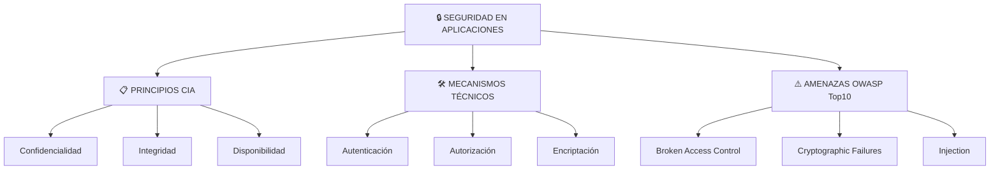
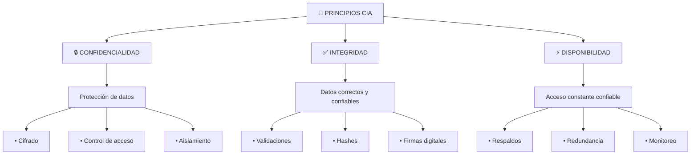
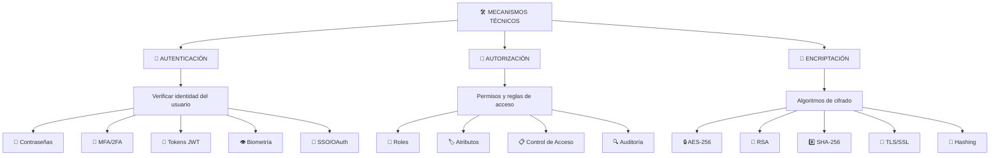
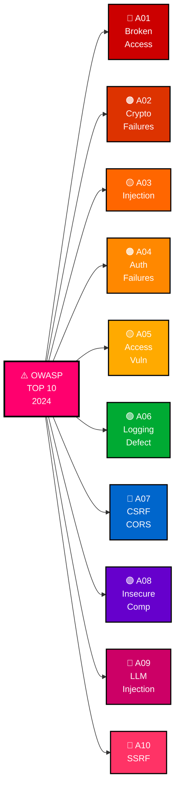
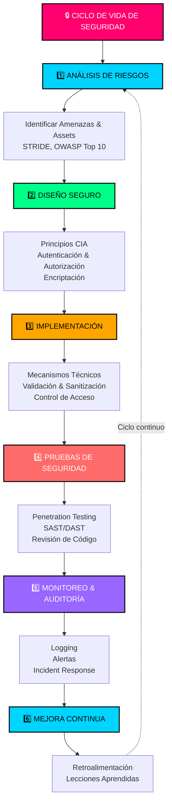

# Mapa Conceptual: Seguridad en Aplicaciones

## 1. Estructura General

---

## 2. Principios Fundamentales (Tríada CIA)

---

## 3. Mecanismos Técnicos de Seguridad

---

## 4. OWASP Top 10 - Vulnerabilidades Críticas

---

## 5. Mapa Conceptual Completo Integrado

```mermaid
graph TD
    ROOT["🔒 SEGURIDAD EN APLICACIONES"]
    
    ROOT --> CIA["📋 PRINCIPIOS CIA"]
    ROOT --> MECH["🛠️ MECANISMOS"]
    ROOT --> OWASP["⚠️ VULNERABILIDADES"]
    
    CIA --> CONF["Confidencialidad"]
    CIA --> INT["Integridad"]
    CIA --> AVAIL["Disponibilidad"]
    
    CONF --> CONF_IMP["Cifrado, Control de Acceso"]
    INT --> INT_IMP["Validaciones, Hashes"]
    AVAIL --> AVAIL_IMP["Respaldos, Redundancia"]
    
    MECH --> AUTH["🔑 Autenticación"]
    MECH --> AUTHZ["👤 Autorización"]
    MECH --> ENC["🔐 Encriptación"]
    
    AUTH --> AUTH_IMP["Contraseñas, MFA, Tokens"]
    AUTHZ --> AUTHZ_IMP["Roles, Permisos, Reglas"]
    ENC --> ENC_IMP["AES-256, RSA, TLS/SSL"]
    
    OWASP --> A01["A01: Broken Access"]
    OWASP --> A02["A02: Cryptographic"]
    OWASP --> A03["A03: Injection"]
    OWASP --> A04["A04: Auth Failures"]
    OWASP --> A05["A05: Access Vuln"]
    
    style ROOT fill:#1a1a2e,stroke:#ff006e,color:#fff,stroke-width:3px
    style CIA fill:#16213e,stroke:#00d4ff,color:#fff
    style MECH fill:#0f3460,stroke:#00ff88,color:#fff
    style OWASP fill:#533483,stroke:#ff006e,color:#fff
    style CONF fill:#2a4858,stroke:#00d4ff,color:#fff
    style INT fill:#2a4858,stroke:#00d4ff,color:#fff
    style AVAIL fill:#2a4858,stroke:#00d4ff,color:#fff
    style AUTH fill:#1f4d6d,stroke:#00ff88,color:#fff
    style AUTHZ fill:#1f4d6d,stroke:#00ff88,color:#fff
    style ENC fill:#1f4d6d,stroke:#00ff88,color:#fff
```

---

## 6. Relación entre Principios y Vulnerabilidades OWASP

| Principio | Mecanismo | Vulnerabilidad OWASP | Riesgo |
|-----------|-----------|----------------------|--------|
| **Confidencialidad** | Cifrado, Control de Acceso | A02 (Cryptographic Failures) | Exposición de datos sensibles |
| **Integridad** | Validaciones, Hashes | A03 (Injection) | Modificación no autorizada |
| **Disponibilidad** | Respaldos, Redundancia | A10 (SSRF) | Indisponibilidad del servicio |
| **Autenticación** | Contraseñas, MFA, Tokens | A04 (Identification & Authentication) | Acceso no autorizado |
| **Autorización** | Roles, Reglas de acceso | A01 (Broken Access Control) | Escalado de privilegios |

---

## 7. Flujo de Implementación de Seguridad

---

## Referencias

- **OWASP**: https://owasp.org/Top10/
- **Tríada CIA**: Confidentiality, Integrity, Availability
- **STRIDE**: Spoofing, Tampering, Repudiation, Information Disclosure, Denial of Service, Elevation of Privilege
- **NIST Cybersecurity Framework**: https://www.nist.gov/cyberframework
