# Mapa Conceptual: Seguridad en Aplicaciones

## 1. Estructura General

---

## 2. Principios Fundamentales (Tríada CIA)

```mermaid
graph TD
    A["🔐 PRINCIPIOS CIA"] 
    A --> B["🔒 CONFIDENCIALIDAD"]
    A --> C["✅ INTEGRIDAD"]
    A --> D["⚡ DISPONIBILIDAD"]
    
    B --> B1["Protección de datos"]
    B1 --> B1a["• Cifrado"]
    B1 --> B1b["• Control de acceso"]
    B1 --> B1c["• Aislamiento"]
    
    C --> C1["Datos correctos y confiables"]
    C1 --> C1a["• Validaciones"]
    C1 --> C1b["• Hashes"]
    C1 --> C1c["• Firmas digitales"]
    
    D --> D1["Acceso constante confiable"]
    D1 --> D1a["• Respaldos"]
    D1 --> D1b["• Redundancia"]
    D1 --> D1c["• Monitoreo"]
```

---

## 3. Mecanismos Técnicos de Seguridad

```mermaid
graph TD
    A["🛠️ MECANISMOS TÉCNICOS"]
    
    A --> B["🔑 AUTENTICACIÓN"]
    A --> C["👤 AUTORIZACIÓN"]
    A --> D["🔐 ENCRIPTACIÓN"]
    
    B --> B1["Verificar identidad del usuario"]
    B1 --> B1a["🔐 Contraseñas"]
    B1 --> B1b["📱 MFA/2FA"]
    B1 --> B1c["🎫 Tokens JWT"]
    B1 --> B1d["👁️ Biometría"]
    B1 --> B1e["🔄 SSO/OAuth"]
    
    C --> C1["Permisos y reglas de acceso"]
    C1 --> C1a["👥 Roles"]
    C1 --> C1b["🏷️ Atributos"]
    C1 --> C1c["📋 Control de Acceso"]
    C1 --> C1d["🔍 Auditoría"]
    
    D --> D1["Algoritmos de cifrado"]
    D1 --> D1a["🔒 AES-256"]
    D1 --> D1b["🔐 RSA"]
    D1 --> D1c["#️⃣ SHA-256"]
    D1 --> D1d["🔗 TLS/SSL"]
    D1 --> D1e["📝 Hashing"]
```

---

## 4. OWASP Top 10 - Vulnerabilidades Críticas

```mermaid
graph LR
    A["⚠️ OWASP<br/>TOP 10<br/>2024"] 
    
    A --> A01["🔴 A01<br/>Broken<br/>Access"]
    A --> A02["🟠 A02<br/>Crypto<br/>Failures"]
    A --> A03["🟡 A03<br/>Injection"]
    A --> A04["🟠 A04<br/>Auth<br/>Failures"]
    A --> A05["🟡 A05<br/>Access<br/>Vuln"]
    A --> A06["🟢 A06<br/>Logging<br/>Defect"]
    A --> A07["🔵 A07<br/>CSRF<br/>CORS"]
    A --> A08["🟣 A08<br/>Insecure<br/>Comp"]
    A --> A09["🩷 A09<br/>LLM<br/>Injection"]
    A --> A10["🩷 A10<br/>SSRF"]
    
    style A fill:#ff006e,stroke:#000,color:#fff,stroke-width:3px
    style A01 fill:#cc0000,stroke:#000,color:#fff,stroke-width:2px
    style A02 fill:#dd3300,stroke:#000,color:#fff,stroke-width:2px
    style A03 fill:#ff6600,stroke:#000,color:#fff,stroke-width:2px
    style A04 fill:#ff8800,stroke:#000,color:#fff,stroke-width:2px
    style A05 fill:#ffaa00,stroke:#000,color:#fff,stroke-width:2px
    style A06 fill:#00aa33,stroke:#000,color:#fff,stroke-width:2px
    style A07 fill:#0066cc,stroke:#000,color:#fff,stroke-width:2px
    style A08 fill:#6600cc,stroke:#000,color:#fff,stroke-width:2px
    style A09 fill:#cc0066,stroke:#000,color:#fff,stroke-width:2px
    style A10 fill:#ff3366,stroke:#000,color:#fff,stroke-width:2px
```

---

## 5. Mapa Conceptual Completo Integrado

```mermaid
graph TD
    ROOT["🔒 SEGURIDAD EN APLICACIONES"]
    
    ROOT --> CIA["📋 PRINCIPIOS CIA"]
    ROOT --> MECH["🛠️ MECANISMOS"]
    ROOT --> OWASP["⚠️ VULNERABILIDADES"]
    
    CIA --> CONF["Confidencialidad"]
    CIA --> INT["Integridad"]
    CIA --> AVAIL["Disponibilidad"]
    
    CONF --> CONF_IMP["Cifrado, Control de Acceso"]
    INT --> INT_IMP["Validaciones, Hashes"]
    AVAIL --> AVAIL_IMP["Respaldos, Redundancia"]
    
    MECH --> AUTH["🔑 Autenticación"]
    MECH --> AUTHZ["👤 Autorización"]
    MECH --> ENC["🔐 Encriptación"]
    
    AUTH --> AUTH_IMP["Contraseñas, MFA, Tokens"]
    AUTHZ --> AUTHZ_IMP["Roles, Permisos, Reglas"]
    ENC --> ENC_IMP["AES-256, RSA, TLS/SSL"]
    
    OWASP --> A01["A01: Broken Access"]
    OWASP --> A02["A02: Cryptographic"]
    OWASP --> A03["A03: Injection"]
    OWASP --> A04["A04: Auth Failures"]
    OWASP --> A05["A05: Access Vuln"]
    
    style ROOT fill:#1a1a2e,stroke:#ff006e,color:#fff,stroke-width:3px
    style CIA fill:#16213e,stroke:#00d4ff,color:#fff
    style MECH fill:#0f3460,stroke:#00ff88,color:#fff
    style OWASP fill:#533483,stroke:#ff006e,color:#fff
    style CONF fill:#2a4858,stroke:#00d4ff,color:#fff
    style INT fill:#2a4858,stroke:#00d4ff,color:#fff
    style AVAIL fill:#2a4858,stroke:#00d4ff,color:#fff
    style AUTH fill:#1f4d6d,stroke:#00ff88,color:#fff
    style AUTHZ fill:#1f4d6d,stroke:#00ff88,color:#fff
    style ENC fill:#1f4d6d,stroke:#00ff88,color:#fff
```

---

## 6. Relación entre Principios y Vulnerabilidades OWASP

| Principio | Mecanismo | Vulnerabilidad OWASP | Riesgo |
|-----------|-----------|----------------------|--------|
| **Confidencialidad** | Cifrado, Control de Acceso | A02 (Cryptographic Failures) | Exposición de datos sensibles |
| **Integridad** | Validaciones, Hashes | A03 (Injection) | Modificación no autorizada |
| **Disponibilidad** | Respaldos, Redundancia | A10 (SSRF) | Indisponibilidad del servicio |
| **Autenticación** | Contraseñas, MFA, Tokens | A04 (Identification & Authentication) | Acceso no autorizado |
| **Autorización** | Roles, Reglas de acceso | A01 (Broken Access Control) | Escalado de privilegios |

---

## 7. Flujo de Implementación de Seguridad

```mermaid
graph TD
    A["🔒 CICLO DE VIDA DE SEGURIDAD"]
    
    A --> B["1️⃣ ANÁLISIS DE RIESGOS"]
    B --> B_DESC["Identificar Amenazas & Assets<br/>STRIDE, OWASP Top 10"]
    B_DESC --> C["2️⃣ DISEÑO SEGURO"]
    
    C --> C_DESC["Principios CIA<br/>Autenticación & Autorización<br/>Encriptación"]
    C_DESC --> D["3️⃣ IMPLEMENTACIÓN"]
    
    D --> D_DESC["Mecanismos Técnicos<br/>Validación & Sanitización<br/>Control de Acceso"]
    D_DESC --> E["4️⃣ PRUEBAS DE SEGURIDAD"]
    
    E --> E_DESC["Penetration Testing<br/>SAST/DAST<br/>Revisión de Código"]
    E_DESC --> F["5️⃣ MONITOREO & AUDITORÍA"]
    
    F --> F_DESC["Logging<br/>Alertas<br/>Incident Response"]
    F_DESC --> G["6️⃣ MEJORA CONTINUA"]
    
    G --> G_DESC["Retroalimentación<br/>Lecciones Aprendidas"]
    G_DESC -.->|"Ciclo continuo"| B
    
    style A fill:#ff006e,stroke:#000,color:#fff,stroke-width:2px
    style B fill:#00d4ff,stroke:#000,color:#000,stroke-width:2px
    style C fill:#00ff88,stroke:#000,color:#000,stroke-width:2px
    style D fill:#ffa500,stroke:#000,color:#000,stroke-width:2px
    style E fill:#ff6b6b,stroke:#000,color:#fff,stroke-width:2px
    style F fill:#9966ff,stroke:#000,color:#fff,stroke-width:2px
    style G fill:#00d4ff,stroke:#000,color:#000,stroke-width:2px
```

---

## Referencias

- **OWASP**: https://owasp.org/Top10/
- **Tríada CIA**: Confidentiality, Integrity, Availability
- **STRIDE**: Spoofing, Tampering, Repudiation, Information Disclosure, Denial of Service, Elevation of Privilege
- **NIST Cybersecurity Framework**: https://www.nist.gov/cyberframework
