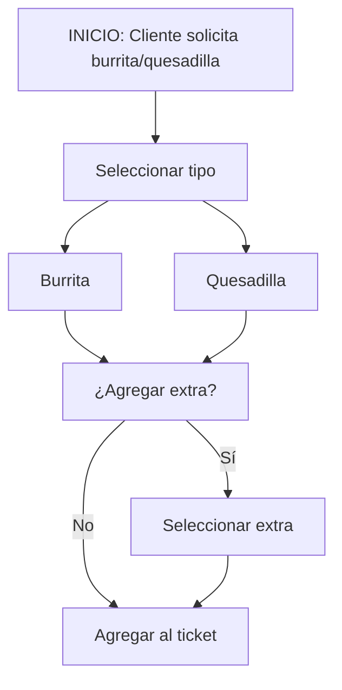

```mermaid
flowchart TD
    A[INICIO: Cliente solicita burrita/quesadilla] --> B[Seleccionar tipo]
    B --> C[Burrita]
    B --> D[Quesadilla]
    C --> E[¿Agregar extra?]
    D --> E
    E -->|Sí| F[Seleccionar extra]
    E -->|No| Z[Agregar al ticket]
    F --> Z
```