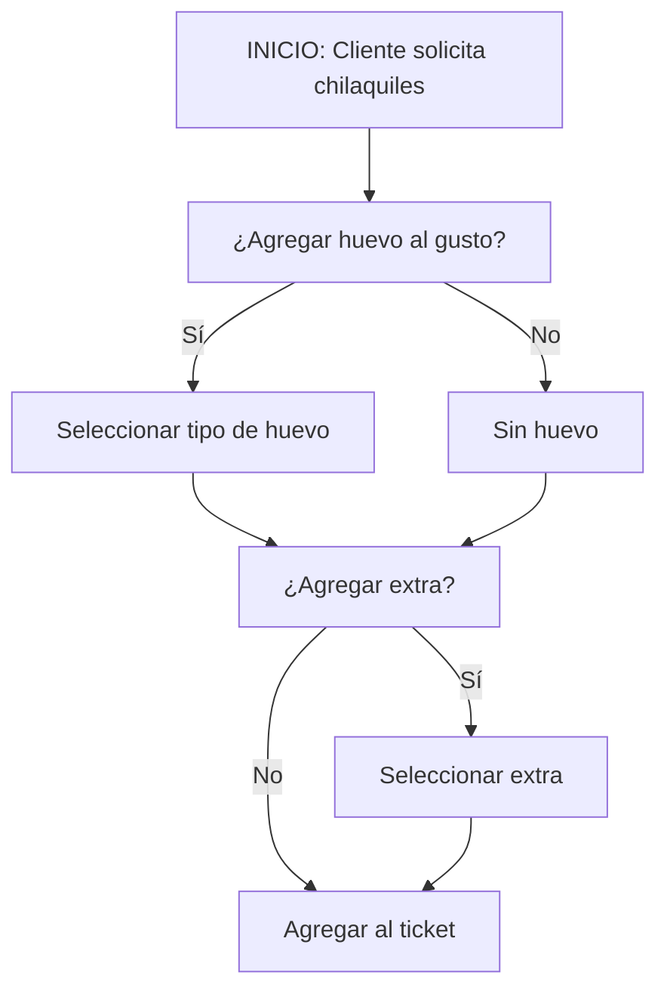

```mermaid
flowchart TD
    A[INICIO: Cliente solicita chilaquiles] --> B[¿Agregar huevo al gusto?]
    B -->|Sí| C[Seleccionar tipo de huevo]
    B -->|No| D[Sin huevo]
    C --> E[¿Agregar extra?]
    D --> E
    E -->|Sí| F[Seleccionar extra]
    E -->|No| Z[Agregar al ticket]
    F --> Z
```