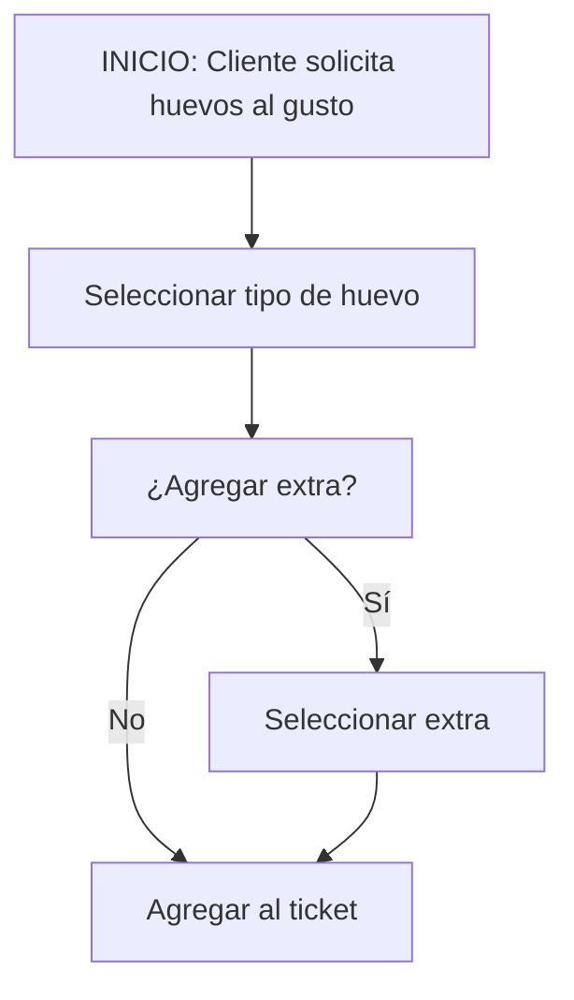

```mermaid
flowchart TD
    A[INICIO: Cliente solicita huevos al gusto] --> B[Seleccionar tipo de huevo]
    B --> C[¿Agregar extra?]
    C -->|Sí| D[Seleccionar extra]
    C -->|No| Z[Agregar al ticket]
    D --> Z
```