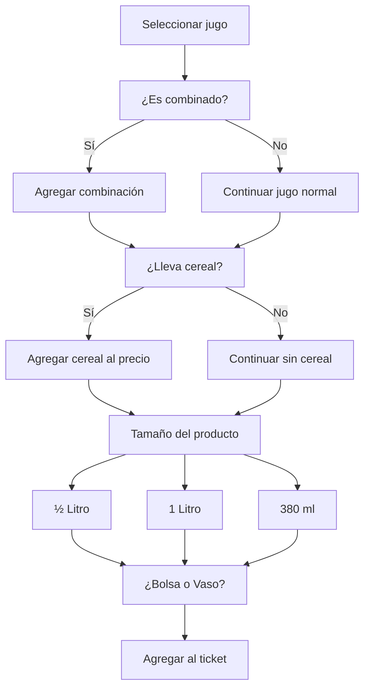

```mermaid
flowchart TD
    D0[Seleccionar jugo] --> D1[¿Es combinado?]
    D1 -->|Sí| D2[Agregar combinación]
    D1 -->|No| D3[Continuar jugo normal]
    D2 --> D4[¿Lleva cereal?]
    D3 --> D4
    D4 -->|Sí| D5[Agregar cereal al precio]
    D4 -->|No| D6[Continuar sin cereal]
    D5 --> T[Tamaño del producto]
    D6 --> T
    T --> T1[½ Litro]
    T --> T2[1 Litro]
    T --> T3[380 ml]
    T1 --> E1[¿Bolsa o Vaso?]
    T2 --> E1
    T3 --> E1
    E1 --> K[Agregar al ticket]
```