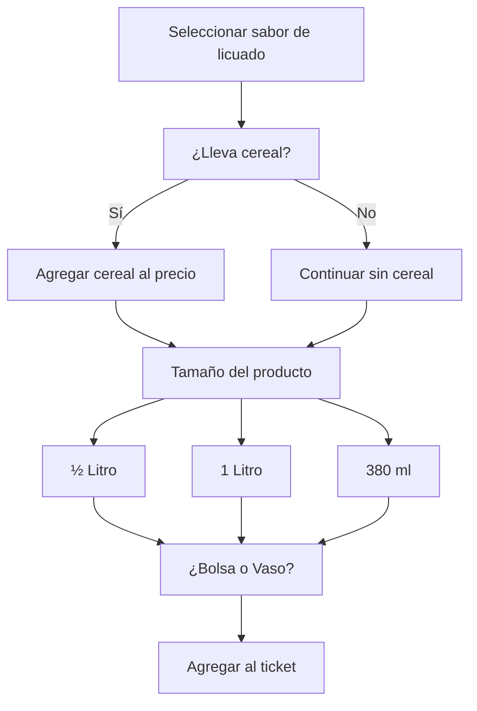

```mermaid
flowchart TD
    C0[Seleccionar sabor de licuado] --> C1[¿Lleva cereal?]
    C1 -->|Sí| C2[Agregar cereal al precio]
    C1 -->|No| C3[Continuar sin cereal]
    C2 --> T[Tamaño del producto]
    C3 --> T
    T --> T1[½ Litro]
    T --> T2[1 Litro]
    T --> T3[380 ml]
    T1 --> E1[¿Bolsa o Vaso?]
    T2 --> E1
    T3 --> E1
    E1 --> K[Agregar al ticket]
```