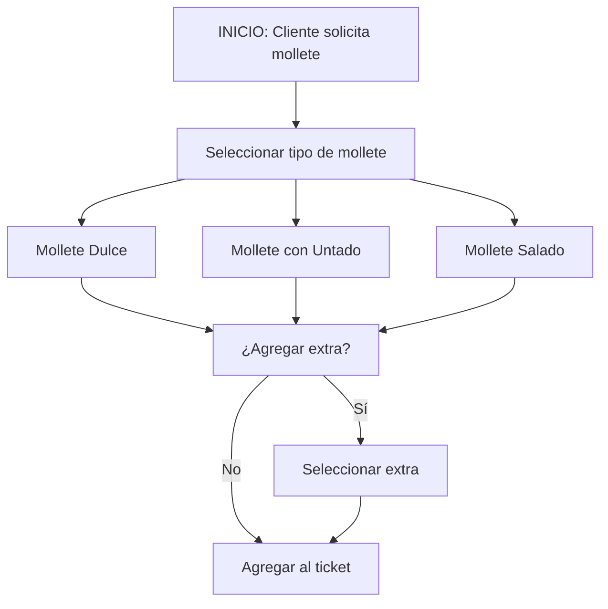

```mermaid
flowchart TD
    A[INICIO: Cliente solicita mollete] --> B[Seleccionar tipo de mollete]
    B --> C[Mollete Dulce]
    B --> D[Mollete con Untado]
    B --> E[Mollete Salado]
    C --> F[¿Agregar extra?]
    D --> F
    E --> F
    F -->|Sí| G[Seleccionar extra]
    F -->|No| Z[Agregar al ticket]
    G --> Z
```