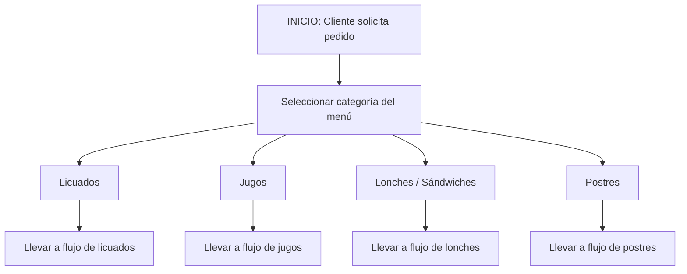

```mermaid
flowchart TD
    A[INICIO: Cliente solicita pedido] --> B[Seleccionar categoría del menú]
    B --> C[Licuados]
    B --> D[Jugos]
    B --> E[Lonches / Sándwiches]
    
    B --> I[Postres]
    %% Cada categoría sigue su propio flujo específico
    C --> F[Llevar a flujo de licuados]
    D --> G[Llevar a flujo de jugos]
    E --> H1[Llevar a flujo de lonches]
    
    I --> H3[Llevar a flujo de postres]
```