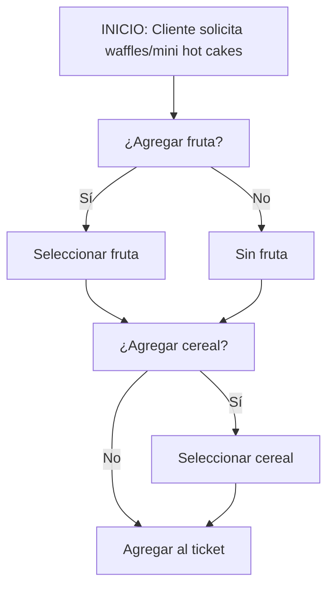

```mermaid
flowchart TD
    A[INICIO: Cliente solicita waffles/mini hot cakes] --> B[¿Agregar fruta?]
    B -->|Sí| C[Seleccionar fruta]
    B -->|No| D[Sin fruta]
    C --> E[¿Agregar cereal?]
    D --> E
    E -->|Sí| F[Seleccionar cereal]
    E -->|No| Z[Agregar al ticket]
    F --> Z
```